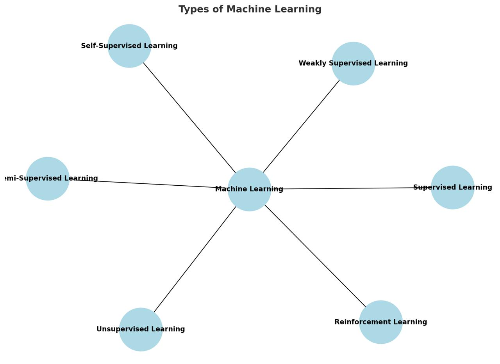
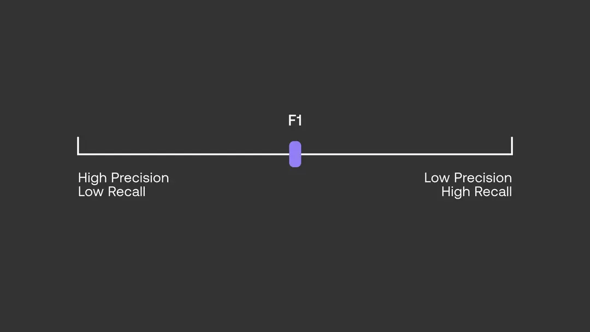

# Session 2: Classification Models in ML

## Overview
1. **Recap**
2. **Classification (What is it?, Types, Use cases)**
3. **Logistic Regression**
4. **K Nearest Neighbors**
5. **Performance Evaluation**
6. **Comparison**

## Introduction
## 1. Recap on Previous Session  
Before diving into classification, let's briefly recap the key concepts covered in the previous session:  
- **Supervised vs. Unsupervised Learning**: Understanding labeled vs. unlabeled data
- **Others: Semi-supervised, weakly supervised, and self-supervised**

| Paradigm               | Labeled Data?                 | Example Use Case           |
| ---------------------- | ----------------------------- | -------------------------- |
| Supervised             | ✅ Full                        | Spam detection             |
| Unsupervised           | ❌ None                        | Customer clustering        |
| Semi-Supervised        | ✅ Partial                     | Medical imaging            |
| Weakly Supervised      | ✅ But noisy/incomplete        | Webly-labeled data         |
| Self-Supervised        | ❌ (auto-labels from data)     | Pretraining (BERT, SimCLR) |
| Reinforcement Learning | ❌ (feedback from environment) | Game playing, robotics     |

---

- **Feature Engineering & Selection**: How to improve model performance by selecting relevant features  

- **Typical ML Workflow/ Pipeline**:

1. Data Collection
    - Gather raw data (CSV, images, etc.)

2. Data Preprocessing
    - Cleaning (handling missing values, duplicates)
    - Normalization/standardization
    - Feature engineering (e.g., creating new features)

3. Splitting the Data
    - Train / Validation / Test

4. Model Training
    - Fit model on training data

5. Evaluation
    - Use validation/test set → metrics (accuracy, precision, recall, etc.)

6. Deployment / Inference
    - Model is applied to new, unseen data

- **Linear Regression**: A fundamental algorithm for predicting continuous values by finding the best-fitting line that minimizes error 

## 2. Classification: Introduction
### What is Classification?
Classification is a **supervised learning task** where the goal is to categorize data into predefined labels. It predicts **discrete outcomes** rather than continuous values (as in regression).

### Types of Classification:

- **Binary Classification**: Two possible labels (e.g., spam vs. not spam).
- **Multiclass Classification**: More than two labels (e.g., digit recognition: 0-9).
- **Multilabel Classification**: Each instance can belong to multiple classes simultaneously (e.g., tagging multiple topics in a news article).

### Industry-Oriented Real-World Use Cases of Classification

- **Finance / Banking**
  - **Credit Scoring** → Classify if a loan applicant is *low-risk* or *high-risk*.

- **Healthcare**
  - **Medical Imaging** → Classify X-rays/MRIs as *healthy* vs. *diseased*.
  - **Patient Risk Prediction** → Classify if a patient is *likely to be readmitted* to hospital or not.

- **Retail / E-commerce**
  - **Customer Churn Prediction** → Classify if a customer is *likely to stop using a service*.
  - **Product Categorization** → Automatically classify products into categories for online stores.

- **Cybersecurity / IT**
  - **Malware Detection** → Classify files as *malicious* vs. *safe*.

- **Transportation / Automotive**
  - **Self-driving Cars** → Classify objects on the road (pedestrian, cyclist, traffic light, stop sign)
  - **Predictive Maintenance** → Classify whether a machine part is *likely to fail soon*

- **Human Resources / Recruitment**
  - **Resume Screening** → Classify candidates as *fit* vs. *not fit* for a job
  - **Employee Attrition Prediction** → Predict if an employee is *likely to leave*

- **Telecommunications**
  - **Customer Support Triage** → Classify support tickets into *technical issue*, *billing issue*, etc.
  - **Spam Call Detection** → Identify and block robocalls.

---
---

## Different Classification Models (Eager vs. Lazy Learners)
Here’s a quick look at classification models and their key characteristics:

### Eager Learners  
Eager learners are machine learning algorithms that first build a model from the training dataset before making any predictions on future datasets. They spend more time during the training process because of their eagerness to achieve better generalization by learning the weights, but they require less time to make predictions.  

Most machine learning algorithms are eager learners, and below are some examples:  

- **Logistic Regression**  
- **Support Vector Machine (SVM)**  
- **Decision Trees**  
- **Neural Networks (NNs)**  

### Lazy Learners  
Lazy learners, or instance-based learners, on the other hand, do not create a model immediately from the training data, which is where the *lazy* aspect comes from. Instead, they memorize the training data, and each time a prediction is needed, they search for the nearest neighbor from the entire training dataset. This makes them very slow during prediction.  

Some examples of lazy learners include:  

- **K-Nearest Neighbor (K-NN)**  
- **Case-Based Reasoning**  

------------------------------------------------------------------------
------------------------------------------------------------------------

## **3. Logistic Regression**
### Intuition Behind Logistic Regression:
- Unlike linear regression, it applies the **sigmoid function** to output probabilities.

### Sigmoid Function:
$$ \sigma(z) = \frac{1}{1 + e^{-z}} $$
where:
$$ z = w_0 + w_1x_1 + w_2x_2 + \dots + w_nx_n $$

### Decision Rule:
- If $$ \sigma(z) > 0.5 $$ then classify as **1** (positive class).
- Otherwise, classify as **0** (negative class).

### Loss Function:
Logistic Regression uses **Binary Cross-Entropy Loss**:
$$ L = -\frac{1}{m} \sum_{i=1}^{m} \left[ y_i \log(\hat{y}_i) + (1 - y_i) \log(1 - \hat{y}_i) \right] $$

### Pros & Cons:
- ✅ **Simple and interpretable**
- ✅ **Works well for linearly separable data**
- ❌ **Struggles with complex relationships**
- ❌ **Sensitive to outliers**

### Coding Time
- [Logistic Regression implemented from scratch](notebooks/logistic_regression_scratch.ipynb)
- [Logistic Regression using SKlearn](notebooks/banking_system_builtin/bank.ipynb)

------------------------------------------------------------------------
------------------------------------------------------------------------

## 4. K-Nearest Neighbors (K-NN)  

### How K-NN Works:  
K-NN is a **lazy learning algorithm** (instance-based) and **non-parametric**, meaning it does not make assumptions about the underlying data distribution. Instead, it memorizes the training data and classifies new instances based on the majority vote of their closest neighbors.  

1. Choose the number of neighbors **K**.  
2. Calculate the **distance** between the query point and all training points using a suitable distance metric (e.g., Euclidean or Manhattan distance).  
3. Select the **K nearest neighbors** based on the smallest distances.  
4. Assign the most common class label among these neighbors to the query point.  

### Distance Metrics in K-NN  

Since K-NN is a **distance-based** classifier, choosing the right distance metric is crucial. The most commonly used metrics are:  

#### 1. **Euclidean Distance (L2 Norm)**  
The Euclidean distance between two points **A(x₁, y₁)** and **B(x₂, y₂)** in a 2D space is given by:  

$$
d(A, B) = \sqrt{(x_1 - x_2)^2 + (y_1 - y_2)^2}
$$  

For **n-dimensional data**, the formula generalizes to:  

$$
d(A, B) = \sqrt{\sum_{i=1}^{n} (x_i - y_i)^2}
$$  

✅ **Best when** features have continuous values and are normally distributed.  

#### 2. **Manhattan Distance (L1 Norm or Taxicab Distance)**  
The Manhattan distance is the sum of absolute differences between the coordinates:  

$$
d(A, B) = |x_1 - x_2| + |y_1 - y_2|
$$  

For **n-dimensional data**, the formula is:  

$$
d(A, B) = \sum_{i=1}^{n} |x_i - y_i|
$$  

✅ **Best when** data is grid-based (e.g., city street maps) or when feature scaling is inconsistent.  
❌ **May not work well for diagonal relationships between points.**  

## Choosing the Right K (Hyperparameter Tuning):  
- **Small K (e.g., K=1 or 3)**:  
  - Leads to high variance (overfitting).  
  - The model is too sensitive to noise in the dataset.  
- **Large K (e.g., K=10 or 20)**:  
  - Leads to high bias (underfitting).  
  - Decision boundaries are too smooth, missing local patterns.  
- **Common practice**:  
  - Choose **odd K values** to avoid ties in binary classification.  
  - Use **cross-validation** to find the optimal K value.  

### Pros & Cons of K-NN  

✅ **Pros**  
- Simple and intuitive to understand.  
- Works well for small datasets with well-separated classes.  
- No explicit training phase; the model is ready after storing data.  

❌ **Cons**  
- **Computationally expensive**: Must calculate distance to all training points for each new prediction.  
- **Sensitive to feature scaling**: Distance calculations are affected if features have different units (solution: normalize or standardize data).  
- **Not effective in high-dimensional space**: Distance differences become less meaningful due to the curse of dimensionality.  

### Coding Time
- [KNN implemented from scratch](notebooks/knn_scratch.ipynb)
- [KNN using scikit-learn](notebooks/knn_builtin.ipynb)

------------------------------------------------------------------------
------------------------------------------------------------------------

## 5. Performance Evaluation for Classification
In a classification task, our main task is to predict the target variable which is in the form of discrete values. To evaluate the performance of such a model there are some metrics we may use

### Key Metrics: (Explained on spam)
1.  **Accuracy**: 
$$
\frac{\text{No. of correct predictions}}{\text{Total number of samples}} $$
 $$
 \frac{TP + TN}{TP + TN + FP + FN} 
$$

- provides a quick snapshot of how well the model is performing in terms of correct predictions.

- Works great if there are an equal number of samples for each class.

Ex:

we have a **90\%** sample of class **A** and a **10\%** sample of class **B** in our training set. Then, our model will predict with an accuracy of **90\%** by predicting all the training samples as belonging to class **A**.  

If we test the same model with a test set consisting of **60\%** from class **A** and **40\%** from class **B**, then the accuracy will fall, and we will get an accuracy of **60\%**.

 
 - problem arises due to the possibility of misclassification of minor class samples being very high

### Confusion Matrix:

|               | Predicted Positive | Predicted Negative |
|--------------|-------------------|-------------------|
| **Actual Positive** | True Positive (TP) | False Negative (FN) |
| **Actual Negative** | False Positive (FP) | True Negative (TN) |

2.  **Precision**: $$ \frac{TP}{TP + FP} $$ (useful when false positives are costly)

- **Recall (Sensitivity)**: $$ \frac{TP}{TP + FN} $$ (important in medical diagnosis)
- **F1-Score**: Harmonic mean of precision & recall $$ 2 \times \frac{Precision \times Recall}{Precision + Recall} $$

- **ROC Curve & AUC**: Measures how well the model distinguishes classes. **Search for this**

Now, search for using classification metrics in multi-class classification
"**The only difference now is each class will have its own set of Precision and Recall values.**"

------------------------------------------------------------------------
------------------------------------------------------------------------

## 6. Comparison: K-NN vs. Logistic Regression
| Feature | K-Nearest Neighbors | Logistic Regression |
|---------|-------------------|-------------------|
| Type | Instance-based (Lazy) | Model-based (Eager) |
| Decision Boundary | Non-linear | Linear |
| Training Time | Fast (no training) | Slower (requires optimization) |
| Inference Time | Slow (computes distance to all points) | Fast (simple formula evaluation) |
| Performance on Large Datasets | Poor (computationally expensive) | Good |
## Summary
- **Classification** is used for categorizing data into discrete labels.
- **K-NN** is simple but computationally expensive for large datasets.
- **Logistic Regression** is efficient for binary classification and interpretable.
- **Evaluation Metrics** (Accuracy, Precision, Recall, F1-score) help assess model performance.

------------------------------------------------------

Extra stuff:
- search for undersampling/ oversampling (data preprocessing)

Resources:

- https://www.datacamp.com/blog/classification-machine-learning
- https://cohere.com/blog/classification-eval-metrics
