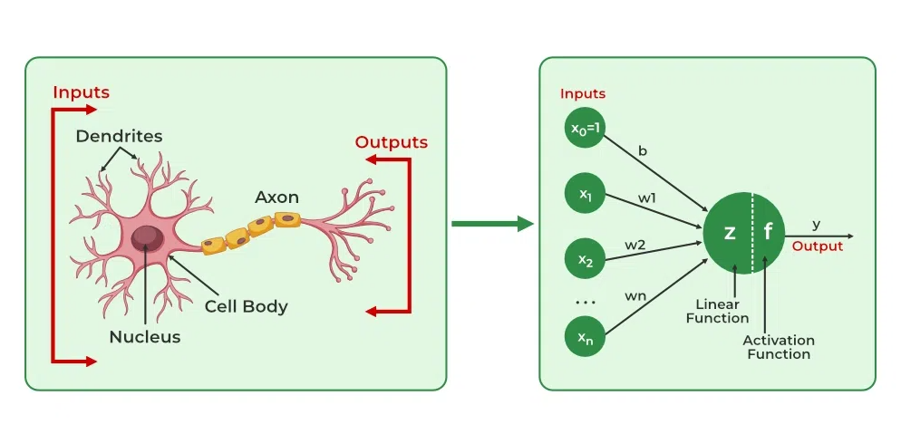
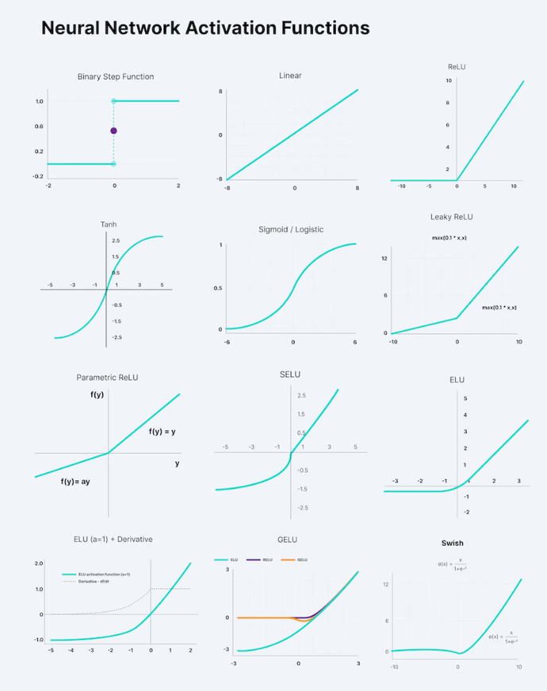

# 🧠 Neural Networks 

---

## 🌟 1. What is a Neural Network?

A **Neural Network (NN)** is a mathematical model loosely inspired by the human brain. It's a set of layers made of **neurons**, where each neuron receives inputs, processes them, and sends output to the next layer.

### 🧠 Biological Analogy:
- **Neuron** → Node
- **Axon strength** → Weight
- **Neuron activation** → Activation function

---

## 📐 2. Network Architecture

A typical **Feedforward Neural Network (FNN)** has:

1. **Input Layer** — accepts input features.
2. **Hidden Layers** — extract patterns.
3. **Output Layer** — gives predictions.

Each neuron computes:

$$
z = \sum_{i} w_i x_i + b 
$$
$$
a = \sigma(z)
$$

Where:
- $x_i$ : Input from previous layer
- $w_i$ : Weight
- $b$ : Bias
- $\sigma$ : Activation function
- $a$ : Output of the neuron

---

## 🔁 3. Forward Propagation

For each layer \( l \):

$$
z^{[l]} = W^{[l]} \cdot a^{[l-1]} + b^{[l]}
$$
$$
a^{[l]} = \sigma(z^{[l]})
$$

Where:
- $a^{[0]} = x$: Input vector
- Final output $\hat{y} = a^{[L]}$

---

## 🎯 4. Loss Function

Measures the prediction error between \( \hat{y} \) and actual \( y \).

### 🔵 Common Loss Functions:
| Task | Function | Formula |
|------|----------|---------|
| Binary Classification | Binary Cross-Entropy | $\mathcal{L} = -[y\log(\hat{y}) + (1 - y)\log(1 - \hat{y})]$ |
| Multi-class | Categorical Cross-Entropy | $\mathcal{L} = -\sum y_i \log(\hat{y}_i)$ |
| Regression | Mean Squared Error (MSE) | $\mathcal{L} = \frac{1}{n}\sum (y_i - \hat{y}_i)^2$ |

---

## 🔙 5. Backpropagation

Used to compute gradients for each weight to reduce loss.

$$
\frac{\partial \mathcal{L}}{\partial W^{[l]}} = \delta^{[l]} \cdot (a^{[l-1]})^T
$$
$$
\delta^{[l]} = \frac{\partial \mathcal{L}}{\partial z^{[l]}}
$$

Gradient flows backward through layers using the chain rule.
We will dive into this after finishing the main intro to Neural Networks.

---

## 📦 6. Activation Functions

| Function | Equation | Use |
|----------|----------|-----|
| **Sigmoid** | $\sigma(x) = \frac{1}{1 + e^{-x}}$ | Binary outputs |
| **Tanh** | $\tanh(x) = \frac{e^x - e^{-x}}{e^x + e^{-x}}$ | Centered at 0 |
| **ReLU** | $f(x) = \max(0, x)$ | Hidden layers |
| **Leaky ReLU** | $f(x) = \max(0.01x, x)$ | Avoids dead neurons |
| **Softmax** | $\frac{e^{z_i}}{\sum_j e^{z_j}}$ | Multi-class **output only** |

Why do Neural Networks Need an Activation Function?

So we know what Activation Function is and what it does, but— 

Why do Neural Networks need it?

Well, the purpose of an activation function is to add non-linearity to the neural network.
Enable networks to model non-linear patterns.
You can read more about activation functions [here](https://www.v7labs.com/blog/neural-networks-activation-functions)

---

### 💡 **What Is the Vanishing Gradient Problem?**

When training deep neural networks (with many layers), sometimes the **gradients (the "signals" used to update the weights)** get **smaller and smaller** as they’re backpropagated to the earlier layers. Eventually, they become so tiny that the **weights in the early layers stop updating** — which means the network **stops learning** properly.

This is called the **vanishing gradient problem**.

---

### 🧠 Why Does It Happen?

It usually comes from **activation functions** like $\sigma$ or $tanh$, which **squash** inputs into a small range:

- $\sigma(x)$ → values between 0 and 1
- $tanh(x)$ → values between -1 and 1

When you take the **derivative** of these functions:
- The gradient is **very small** when the input is large or small (far from 0).
- So when you chain many layers (via backprop), multiplying a lot of small numbers → you get something *very close to zero*.

---

### 📉 Example (Sigmoid):
- Let’s say your derivative is around **0.1** in each layer.
- In a 10-layer network, the gradient becomes:
  $0.1^{10} = 0.0000000001$
That’s **basically zero**, and that's why early layers don't learn much.

---

### ⚠️ What Are the Symptoms?

- Your model trains **very slowly**.
- Loss **doesn’t decrease** (especially in early epochs).
- The **early layers** have weights that barely change.
- Training deeper networks becomes super hard without tricks.

---

### ✅ How Do We Fix It?

1. **Use ReLU (Rectified Linear Unit)** activation:
   - Unlike sigmoid/tanh, **ReLU doesn’t squash** its output as much.
   - Derivative is **1** for positive inputs → no vanishing.

2. **He or Xavier Initialization**:
   - Smart ways to initialize weights to avoid very small or very large outputs that hurt gradients. You can read about them more [here](https://medium.com/@piyushkashyap045/mastering-weight-initialization-in-neural-networks-a-beginners-guide-6066403140e9).

3. **Batch Normalization**:
   - Keeps the data flowing through each layer **centered and scaled**, which helps gradients stay healthy.

4. **Residual Connections (ResNets)**:
   - Instead of just passing data through layers, they add “shortcuts” that help **gradient flow** better.

---

### 🤖 Real World Analogy:

> "Imagine trying to shout a message down a long tunnel. Each person relays the message by whispering. By the time it reaches the end, it’s basically inaudible — that’s what happens with vanishing gradients in deep networks."

---

## 📊 7. Optimizers

Optimizers minimize the loss by adjusting weights.

### 📉 **Stochastic Gradient Descent (SGD)**

$$
\theta = \theta - \eta \cdot \nabla_\theta \mathcal{L}
$$

- $( \eta )$: Learning rate
- $( \nabla_\theta \mathcal{L} )$: Gradient of loss

### ⚙️ **Adam Optimizer**

Adaptive optimizer combining momentum + RMSProp:

$$
m_t = \beta_1 m_{t-1} + (1 - \beta_1) \cdot g_t
$$
$$
v_t = \beta_2 v_{t-1} + (1 - \beta_2) \cdot g_t^2
$$
$$
\hat{m}_t = \frac{m_t}{1 - \beta_1^t}, \quad \hat{v}_t = \frac{v_t}{1 - \beta_2^t}
$$
$$
\theta = \theta - \eta \cdot \frac{\hat{m}_t}{\sqrt{\hat{v}_t} + \epsilon}
$$

---
## 📏 8. Batches:

In deep learning, instead of feeding the entire dataset into the model at once, we split it into smaller groups called **batches**.

---

#### 🔢 Key Terms

- **Epoch**: One full pass over the entire training dataset.
- **Batch**: A small group of samples (e.g., 8, 16, 32, 64...) taken from the dataset to process at one time.
- **Batch Size**: The number of samples in each batch.

---

#### 🧠 Why Use Batches?

1. 🚀 **Speed**: It's faster and uses less memory than processing the entire dataset at once.
2. 🧮 **More Frequent Learning**: The model updates its weights after each batch, not just once per epoch.
3. 📉 **Stochasticity**: Adds randomness that helps the model generalize better and avoid getting stuck in local minima.

---

#### 📚 Example

Suppose you have **80 training samples** and set a **batch size of 8**:

- Number of batches per epoch = `80 ÷ 8 = 10`
- So the model will perform **10 forward and backward passes** in one epoch.

For each batch:
1. 8 samples are selected.
2. Passed through the model (forward pass).
3. Loss is calculated.
4. Gradients are computed and weights are updated (backward pass).

---

## ⏱️ Trade-offs

| Batch Size        | Pros                                | Cons                                      |
|-------------------|-------------------------------------|-------------------------------------------|
| Small (e.g. 8, 16)  | More updates, regularizes better     | Noisy gradients, slower per epoch         |
| Large (e.g. 128, 256)| Faster per epoch, stable gradients  | Less frequent updates, higher memory use  |

---
## ✅ TL;DR

- A **batch** is a subset of your training data.
- It's how many samples your model processes at one time.
- You control it using **batch size**.
- Smaller batch = more updates, more noise.
- Larger batch = smoother gradients, less frequent updates.

---

## 🧪 9. Regularization

Prevents overfitting.

### 🔒 L2 Regularization:
$$
\mathcal{L}' = \mathcal{L} + \lambda \sum W^2
$$

### 💧 Dropout:
What is it?
Dropout is a regularization technique where neurons are randomly "dropped" (deactivated) during training. This prevents the network from becoming too dependent on specific neurons, promoting redundancy and robustness.

Why?
Neural networks with many parameters are powerful but can overfit the training data. Dropout:

- Forces the network to not rely too much on any single neuron.

- Encourages neurons to learn useful features independently.

---

## 🧠 9. Types of Neural Networks

| Type | Description | Use Case |
|------|-------------|----------|
| **MLP** | Fully connected | Tabular data |
| **CNN** | Convolutional layers | Images, video |
| **RNN / LSTM / GRU** | Sequential data | Text, time series |
| **Transformers** | Attention-based | NLP, vision |

---

## 📝 Quick Recap

| Term | Meaning |
|------|---------|
| Epoch | One full pass through training data |
| Batch | A group of samples processed together |
| Optimizer | Algorithm that updates weights |
| Loss Function | Measures prediction error |
| Activation Function | Adds non-linearity |

---

