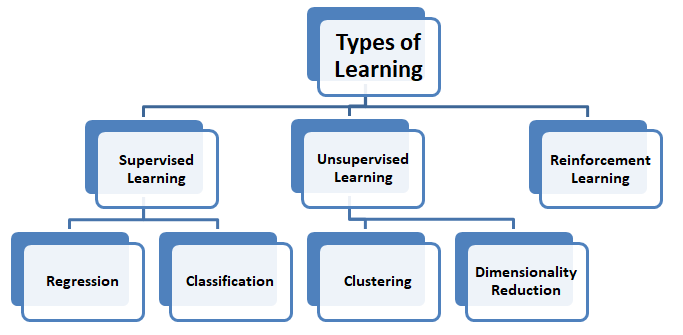
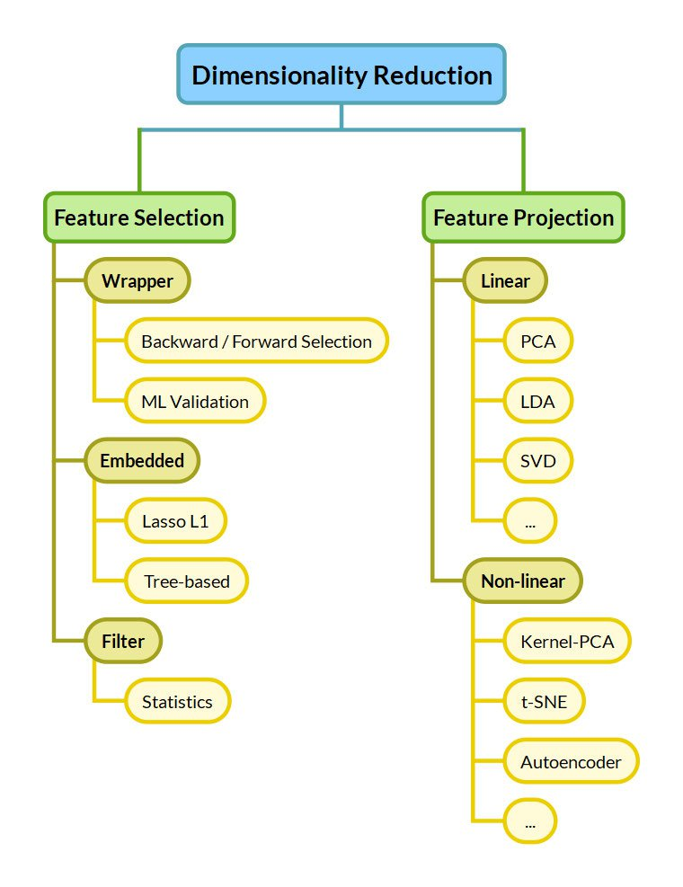

# ML Session05: Unsupervised Learning; PCA & K-Means

## Session Overview

In this session, we will explore key concepts in **Unsupervised Learning**, focusing on:
1. Understanding what unsupervised learning is and how it differs from supervised learning
2. Real-life applications of unsupervised learning
3. Common algorithms in unsupervised learning, **Principal Component Analysis (PCA)** and **K-Means Clustering**
4. Hands-on implementation and visualization using Python and Scikit-learn

---

---

## 1. What is Unsupervised Learning?

Unsupervised learning is a type of machine learning where the model is given **unlabeled data**, and the goal is to discover **underlying patterns**, **groupings**, or **structures** without explicit supervision.

There is **no ground truth output** provided, just input data. 
The algorithm tries to:
- Find clusters or groups (clustering)
- Reduce dimensionality (feature extraction)
- Detect anomalies or unusual patterns

---

## Supervised vs. Unsupervised Learning

| Aspect                  | Supervised Learning                    | Unsupervised Learning                      |
|-------------------------|----------------------------------------|--------------------------------------------|
| Input                   | Labeled data (features + target)       | Unlabeled data (features only)             |
| Goal                    | Learn a mapping from input to output   | Discover hidden patterns or structure      |
| Example Algorithms      | Linear Regression, Decision Trees, SVM | K-Means, PCA, DBSCAN                       |
| Applications            | Spam detection, fraud prediction       | Customer segmentation, anomaly detection   |

---

## Common Unsupervised Learning Methods

1. **Clustering Algorithms**

Clustering is a technique for exploring raw, unlabeled data and breaking it down into groups (or clusters) based on similarities or differences. 
   - Exclusive, Overlapping, Hierarchical, Probabilistic 
   - **K-Means Clustering** – Groups data into *k* distinct clusters
   
   - **DBSCAN** – Density-based clustering for arbitrary shapes
   - **Hierarchical Clustering** – Builds a tree of clusters
----

2. **Dimensionality Reduction**

Dimensionality reduction is an unsupervised learning technique that reduces the number of features, or dimensions, in a dataset. More data is generally better for machine learning, but it can also make it more challenging to visualize the data.
Dimensionality reduction extracts important features from the dataset, reducing the number of irrelevant or random features present. 
   - **Principal Component Analysis (PCA)** – Projects data into lower-dimensional space while preserving variance
   - **t-SNE, UMAP** – Used for visualization of high-dimensional data

.

3. **Association**

Association rule mining is a rule-based approach to reveal interesting relationships between data points in large datasets. Unsupervised learning algorithms search for frequent if-then associations—also called rules—to discover correlations and co-occurrences within the data and the different connections between data objects. 

---

## Real-Life Applications of Unsupervised Learning

### 1. Customer Segmentation in Retail or E-commerce (Clustering)

**Real-life angle:** Think of how Netflix(aw haga tanya 3shan moqat3a) groups users to recommend movies, or how Zara(same here bayen) sends different offers to different customer groups.

- **Technique:** Clustering (e.g., K-Means)
- **Purpose:** Group customers by behavior (purchases, location, age)
- **Outcome:** Personalized marketing and recommendations without needing labeled data

---

### 2. Product Placement in Supermarkets (Association Rules)

**Real-life angle:** Why are chips and soda often placed together?

- **Technique:** Market Basket Analysis (e.g., Apriori Algorithm)
- **Purpose:** Discover patterns in what people buy together
- **Outcome:** Smart product placement to increase sales

---

### 3. Organizing Photos on Your Phone (Clustering + Dimensionality Reduction)

**Real-life angle:** Your phone creates albums like "Wedding," "Vacation," or "Friends" automatically.

- **Technique:** Clustering photos by face, location, or color histograms
- **Purpose:** Auto-grouping similar photos
- **Outcome:** Organized albums without manually tagging every photo

---

### 4. Music Recommendation Systems (Clustering + Embedding Spaces)

**Real-life angle:** Spotify recommends songs that match your vibe.

- **Technique:** Clustering audio features (tempo, genre, mood)
- **Purpose:** Group similar songs/users
- **Outcome:** Discover music you’ll probably like — without labeled preferences

---

# **2. Clustering**

 - Soft Clustering: 
 
  Each data point is strictly assigned to one cluster, meaning that a point can only belong to one 
cluster and not to multiple clusters.
 - Hard Clustering: 
 
  Each data point can belong to multiple clusters with a probability, indicating how likely a data 
point is to belong to different clusters. This allows for overlapping between clusters, which may 
share common features

## 2.1. **K-means**
K-Means is a centroid-based clustering algorithm where data points are assigned to clusters based on the 
closest centroid. The algorithm operates iteratively, improving the position of the centroids over time until a 
local optimal clustering is reached

### Intuition
- K-Means aims to partition a set of n observations into k clusters.
- Each observation belongs to the cluster with the nearest mean (also called the cluster centroid).
- The goal is to minimize the within-cluster sum of squares (WCSS), also known as inertia.

### Algorithm Steps
1. Choose the number of clusters k: Decide how many groups (clusters) you want to divide your data into.

2. Initialize k centroids randomly: Randomly pick k data points as the initial centroids (center points of clusters).

3. Assignment Step: 

   For each data point in the dataset:
      - Calculate the distance between the point and each centroid (Euclidean Distance)
      - Assign the point to the nearest centroid (i.e., the closest cluster)

The Euclidean distance between two points in an n-dimensional space is given by:
$$
d(\mathbf{x}, \mathbf{y}) = \sqrt{\sum_{i=1}^{n} (x_i - y_i)^2}
$$

4. Update Step:

   After all points are assigned to clusters:
      - Recalculate the centroid of each cluster as the mean of all points assigned to that cluster

$$
C_k = \frac{1}{|S_k|} \left( x_1 + x_2 + \dots + x_n \right)

 = \frac{1}{|S_k|} \sum_{x_i \in S_k} x_i
$$

5. Repeat steps 3 and 4: 

   Keep reassigning points and updating centroids until:

      - The centroids do not change significantly (convergence), or
      - A maximum number of iterations is reached

### Stopping Criteria
The K-Means algorithm stops iterating when one of the following conditions is met:

1. **Data points stay in the same cluster** – When the assignment of data points to clusters no longer changes.

2. **Centroids remain the same** – When the centroids no longer move, indicating convergence.
3. **Distance threshold** – The algorithm stops if the distance between data points and their centroids falls below a specified threshold.
4. **Maximum iterations** – The algorithm stops after a set number of iterations to prevent excessive computation if convergence is slow.

### Advantages of K-Means Clustering
 - Simple to understand and implement:
 K-Means is easy to apply as it iteratively refines the 
centroids until it converges.
 - Computationally efficient: 
 It is faster and works well with large datasets compared to 
other clustering techniques like hierarchical clustering.
 - Suitable for large datasets: 
 Due to its efficiency, K-Means is ideal for large datasets with 
millions of data points.

### Problems that K-Means Faces:

1. **Choice of K (Number of Clusters)**:
   - K-Means requires the user to specify the number of clusters (K) beforehand. Choosing the wrong value for K can lead to poor results, and there's no inherent method in K-Means to automatically determine the optimal number of clusters.

2. **Sensitivity to Initialization**/ **Convergence to Local Minima**:
   - The algorithm is sensitive to the initial placement of centroids. If the initial centroids are poorly chosen, the algorithm may converge to a suboptimal solution, often stuck in a local minimum. This is why techniques like K-Means++ are used to improve initialization.

3. **Assumption of Spherical Clusters**:
   - K-Means assumes that clusters are spherical (circular in 2D) and of similar size. It struggles with clusters that are non-spherical, uneven in size, or have varying densities.
   - **keywords** search for GMM/ EM algos

4. **Sensitivity to Outliers**:
   - K-Means is highly sensitive to outliers because the centroid is the mean of all points in the cluster, and outliers can significantly skew the mean, distorting the results.

### Elbow Method:
A technique used to determine the optimal number of clusters (K) for K-Means clustering

#### The idea

- In k-means, you have to pick k (the number of clusters).
- But if you keep increasing k, the model will always get "better" (smaller error), because more clusters = points are closer to their centroids.
- The question is: where to stop?
- That’s where the elbow method comes in.

#### How it works

1. Run k-means for different values of k (say 1 → 10).

2. For each k, compute the SSE (Sum of Squared Errors), also called inertia = how far points are from their cluster centers.
   - Small SSE = good (tight clusters).

3. Plot SSE vs. k.
   - At first, SSE drops a lot as k increases.
   - After some point, adding more clusters doesn’t reduce SSE much → it flattens out.

4. The point where the curve bends (like an elbow) is the “optimal” k.

**Steps:**
1. **Run K-Means for Different K Values**:
   - You run the K-Means algorithm for a range of values of K (e.g., from 1 to 10).

2. **Calculate WSS (Inertia/ Within-Cluster Sum of Squares)**:
   - For each K, calculate the **within-cluster sum of squared errors (WSS)**, which measures the compactness of the clusters (i.e., how close the data points are to their centroids).
   - WCSS = ∑ᵢ=1ᵏ ∑ₓ∈Cᵢ ||x - μᵢ||²

3. **Plot the Elbow Curve**:
   - Plot K (number of clusters) on the x-axis and the WSS on the y-axis. You’ll typically see a steep drop in WSS as K increases, but after a certain point, the rate of decrease slows down.

4. **Identify the Elbow**:
   - The "elbow" point is where the curve starts to level off. This is the point where adding another cluster doesn't significantly improve the WSS. The value of K at the elbow is considered the optimal number of clusters.

---
## 3. **Dimensionality Reduction**

### 3.1. The Curse of Dimensionality

The **Curse of Dimensionality** refers to the collection of challenges that arise when analyzing and organizing data in high-dimensional spaces. As the number of dimensions (features) increases, several issues begin to affect data analysis and machine learning models.

---

**Key Problems**

1. **Data Sparsity**  
   - In high dimensions, data points become increasingly sparse.  
   - This makes it difficult to find reliable patterns or clusters.

2. **Exponential Growth in Computation**
   - The number of grid cells, parameters, or samples needed grows exponentially with the number of dimensions.
   - More features → More data required to generalize well → Overfitting if insufficient samples.

3. **Harder to Visualize**
   - Human intuition and most plots work only in 2D or 3D.
   - Understanding what’s happening in 50D space is nearly impossible without projection methods

4. **Redundant or Irrelevant Features**
   - High-dimensional datasets often contain irrelevant or noisy features, which confuse models.
   - Feature selection or dimensionality reduction becomes necessary.
---

### Example: Distance Breakdown

As dimensions increase, the difference between the nearest and farthest neighbor distances shrinks:

| Dimensions | Nearest Distance | Farthest Distance | Ratio |
|------------|------------------|-------------------|-------|
| 1          | 0.1              | 1.0               | 0.1   |
| 10         | 0.75             | 0.9               | 0.83  |
| 100        | 0.95             | 0.99              | 0.96  |

> In high dimensions, the distances are almost the same,  reducing their usefulness.

> In summary, The Curse of Dimensionality reminds us that **more features ≠ better models**. Careful feature engineering and dimensionality reduction are essential for effective learning in high-dimensional spaces.

## 3.2. How to Address It? Dimensionality Reduction

- **Feature Selection**: chooses a subset of the existing features (columns) in your dataset that are most relevant to the task.
- **Feature Extraction**: Feature extraction creates new features by transforming or combining the original ones, often reducing dimensionality in the process.

### Feature Extraction VS Feature Selection

--------------------

## **3.3 Principal Component Analysis (PCA)**

PCA works by transforming high-dimensional data into a lower-dimensional space while maximizing the variance (or spread) of the data in the new space. This helps preserve the most important patterns and relationships in the data.

> Note: It prioritizes the directions where the data varies the most (because more variation = more useful information.)

> Since PCA is a linear model, this mapping will be a projection

### Let’s understand it’s working in simple terms:

Imagine you’re looking at a messy cloud of data points (like stars in the sky) and want to simplify it. PCA helps you find the “most important angles” to view this cloud so you don’t miss the big patterns.

> [The slides I explained were all taken from this video](https://www.youtube.com/watch?v=g-Hb26agBFg)

Before diving into PCA, we need a quick:

## **Maths Recap**

### • Mean
The average of a set of values. For a variable \( x \):

$$
\bar{x} = \frac{1}{n} \sum_{i=1}^{n} x_i
$$

---

### • Variance
Measures how much the values of a variable differ from the mean:

$$
\text{Var}(x) = \frac{1}{n} \sum_{i=1}^{n} (x_i - \bar{x})^2
$$

---

### • Covariance
Measures how two variables vary together. A positive value indicates that the variables increase together, while a negative value indicates an inverse relationship:

$$
\text{Cov}(x_1, x_2) = \frac{1}{n - 1} \sum_{i=1}^{n} (x_{1i} - \bar{x}_1)(x_{2i} - \bar{x}_2)
$$

---

### • Covariance Matrix
A square matrix that contains covariances between multiple variables. For a dataset with \( d \) features, it's a \( d \times d \) matrix where each element \( (i, j) \) is:

$$
\text{Cov}(x_i, x_j)
$$

It helps us understand relationships between all pairs of features.

---

### • Linear Transformation
A linear transformation is a way of changing the space your data lives in, like rotating, stretching, or projecting it, using linear operations. 

This transformation is done using matrix multiplication, we multiply our centered data matrix by the matrix of eigenvectors. That gives us the new coordinates (principal components) of the data.

---

### • Eigenvalue Decomposition
A method of breaking down a square matrix into its eigenvalues and eigenvectors. For a square matrix \( A \):

$$
A \vec{v} = \lambda \vec{v}
$$

- \( v \) is an **eigenvector**
- \( lambda \) is its **eigenvalue**

This is used in PCA to find the principal components (directions of maximum variance).

## **Step by step for PCA:**

### 1. **Standardization**

Since PCA is affected by the scale of the data, it is important to standardize the dataset.

$$
Z = \frac{X - \mu}{\sigma}
$$

- Where $$ \mu $$ is the mean  and $$  \sigma $$ is the standard deviation. 
- This step ensures that each feature contributes equally.  

### 2. **Compute the Covariance Matrix**

The covariance matrix helps understand the relationships between different features.

- A symmetric matrix showing covariance between each pair of features.

### 3. **Find the “Magic Directions” (Principal Components)**

- Eigenvectors represent the directions of the new feature space.
- Eigenvalues determine their magnitude (importance).

### 4. **Sort Eigenvalues and Select Top k Eigenvectors**

- Sort the eigenvalues in descending order.
- Select the top **k** eigenvectors corresponding to the **k** largest eigenvalues.
- These eigenvectors form the **principal components**.

### 5. **Transform the Original Dataset**

- Project the original data onto the new **k-dimensional** feature subspace using:

$$
Y = X \cdot W
$$

- Where \( W \) is the matrix of selected eigenvectors (principal components).
- The result is the transformed dataset with reduced dimensions.

## Summary

| Step | Description |
|------|-------------|
| 1 | Standardize the dataset |
| 2 | Calculate the covariance matrix |
| 3 | Compute eigenvalues and eigenvectors |
| 4 | Choose top k eigenvectors |
| 5 | Reconstruct or transform the data |

---

### **Conclusion**

To wrap up, **unsupervised learning** gives us powerful tools to uncover hidden patterns in data without using labels.  
We explored two fundamental techniques:

- **PCA** helps us **understand and reduce dimensionality**, making high-dimensional data easier to visualize and process. It transforms the data into a space that preserves the most important variance, allowing us to focus on what truly matters.

- **K-Means** enables us to **group similar data points** based on proximity, offering insights into natural structure or segmentation in the dataset. We also saw how the initialization strategy, like K-Means++, and evaluation metrics like WSS can greatly affect results.

Together, PCA and K-Means often complement each other - with PCA preparing the data for better clustering, and K-Means revealing the groupings within.

While unsupervised learning can be more challenging to validate, it's incredibly valuable for **exploratory analysis**, **preprocessing**, and discovering **unexpected insights** - especially in real-world, unlabeled datasets.

---
## Resources
1. [What is unsupervised learning?](https://cloud.google.com/discover/what-is-unsupervised-learning)
2. [K-Means Clustering Algorithm](https://www.analyticsvidhya.com/blog/2019/08/comprehensive-guide-k-means-clustering/)
3. [The Curse of Dimensionality](https://www.youtube.com/watch?v=9Tf-_mJhOkU)
4. [Feature Selection vs Feature Extraction](https://vitalflux.com/machine-learning-feature-selection-feature-extraction/#google_vignette)
5. [PCA video (highly recommended)](https://www.youtube.com/watch?v=g-Hb26agBFg)
6. [PCA article](https://www.geeksforgeeks.org/principal-component-analysis-pca/)
7. University of Toronto, Introduction to Machine Learning Course
8. [Eigen vectors & eigen values](https://www.youtube.com/watch?v=PFDu9oVAE-g)