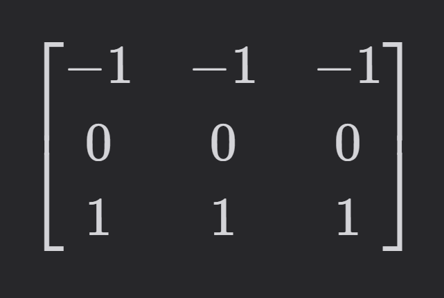

# Convolutional Neural Networks (CNNs) 

Convolutional Neural Networks (CNNs) are a class of **deep learning** models highly effective for analyzing **visual data**, such as images and videos.


---

## 🧠 What is a CNN?

A **Convolutional Neural Network (CNN)** is a type of deep learning model specifically designed to **process data with a grid-like topology**, such as images.

Instead of treating each pixel individually (like traditional neural networks), CNNs learn patterns **spatially** — meaning they learn how groups of pixels interact.

---


## ❓ Why Use CNNs for Images?

Traditional neural networks (fully connected) don’t scale well for large images:

* A 256x256 image has **65,536** pixels.
* A fully connected network with 3 such images would have **millions of weights**!

CNNs **reduce the number of parameters** by reusing weights through filters (kernels), which makes them efficient and scalable.

---

## 🧩 Key Components

---

### 🧱 Convolutional Layer

* This is the **core building block** of a CNN.
* It applies a **filter (kernel)** to the input image, sliding it across and computing **dot products** between the filter and the input.

```python
# Example using PyTorch
import torch
import torch.nn as nn

conv = nn.Conv2d(in_channels=1, out_channels=1, kernel_size=3)
input = torch.randn(1, 1, 5, 5)  # batch_size, channels, height, width
output = conv(input)
print(output.shape)
```


---

#### 🤖 Is "Batch" Just Parallelism?

**Not exactly**, but it **enables parallelism**.

---

#### ✅ What Does a Batch Really Mean?

A **batch** is a collection of **independent input samples** (e.g., images or videos) grouped together and processed at once **in a single forward and backward pass**.

* These samples **do not interact** with each other during computation.
* They are **stacked** into a single tensor to allow efficient computation — **especially on GPUs**.

---

#### 📦 Think of a Batch Like This:

If you have:

* Image 1: shape `[3, 64, 64]`
* Image 2: shape `[3, 64, 64]`

Then batching them gives a tensor of shape:
`[2, 3, 64, 64]` → meaning **2 images in the batch**

So yes, the CNN processes them **in parallel** under the hood, **but the concept of batch is higher-level** — it's more about:

1. **Efficiency**
2. **Stability of training**
3. **Faster convergence** using multiple samples at once

---

#### 🤔 What If the Inputs Are Different?

All samples in a batch **must have the same shape**.
So if you have:

* Image 1: `[3, 64, 64]`
* Image 2: `[3, 128, 128]`

➡️ You **can't put them in the same batch directly**.

You must:

* **Resize** or **pad** them to the same shape, **or**
* **Use dynamic batching** with padding and masking (common in NLP)

---

#### ⚙️ Summary

| Concept             | Explanation                                                             |
| ------------------- | ----------------------------------------------------------------------- |
| Batch               | A group of input samples processed together                             |
| Enables Parallelism | Yes, GPUs process batches in parallel, but batching ≠ just parallelism  |
| Must be same shape? | ✅ Yes — all inputs in a batch must be same shape                        |
| Different shapes?   | ❌ Not allowed in one batch directly — need resizing or special handling |

---

> ✅ **Conclusion**: A batch is **not just about parallelism**, but about **efficient group processing**. It allows us to train faster, smoother, and with better use of hardware — **but all inputs in a batch must have the same shape**.

---

### 🔍 Filters (Kernels)

A **filter** is a small matrix (e.g., 3x3 or 5x5) that slides over the input image to **extract features**.

**Types of patterns filters can detect:**

* Vertical/Horizontal edges
* Diagonal edges
* Textures (like fur, bricks, etc.)

#### 🧠 Analogy:

> Imagine a detective scanning a fingerprint. They don’t analyze every dot one by one. Instead, they look for **patterns** — whorls, loops, ridges.

CNNs work similarly. They apply **filters** to detect patterns like edges, textures, and shapes.

---

#### 📷 Visual Example

| Input Image | Filter (Edge Detection)                  | Output             |
| ----------- | ---------------------------------------- | ------------------ |
|  |  | |

You can read more about filters on [this article](https://www.digitalocean.com/community/tutorials/filters-in-convolutional-neural-networks).

This is an animation of the [convolution of filters](https://github.com/jerpint/cnn-cheatsheet).

#### 🧠 CNN Filters Are Learned, Not Pre-Written

Unlike traditional image processing methods that use **hand-crafted filters** (like edge detectors, blur filters, etc.), **Convolutional Neural Networks (CNNs) learn their own filters automatically during training**.

---

#### ❓ What Does That Mean?

- At the start of training, each convolutional filter (kernel) is initialized with **random values**.
- These filters are like small weight matrices that slide over the input image to detect patterns.
- The network **does not know** beforehand what patterns to look for.

---

#### 🔄 How Do CNNs Learn Different Filters?

1. **Forward pass:**
   - The input passes through convolutional layers.
   - Filters convolve over the input, producing feature maps.
   - The network makes a prediction based on these feature maps.

2. **Loss computation:**
   - The prediction is compared to the true label using a **loss function** (e.g., cross-entropy).
   - This gives a measure of how wrong the prediction is.

3. **Backward pass (Backpropagation):**
   - The network calculates the **gradient** of the loss with respect to each filter’s weights.
   - This gradient tells how each filter should change to reduce the loss.

4. **Weight update:**
   - Using an optimizer (e.g., SGD or Adam), the filters' weights are updated slightly in the direction that reduces the loss.

---

#### 🎯 Over Many Iterations:

- Filters gradually become specialized to detect useful features:
  - Early layers learn simple patterns like **edges, colors, and textures**.
  - Deeper layers learn more complex, abstract features like **object parts or shapes**.
- The network **learns filters that help it perform better on the given task** by minimizing the loss.

---

#### ⚙️ Summary

| Step              | Description                                               |
|-------------------|-----------------------------------------------------------|
| Initialization    | Filters start as random values                             |
| Forward Pass      | Filters extract features by convolving over inputs         |
| Loss Calculation  | Measures prediction error                                  |
| Backpropagation   | Computes how to adjust filters to reduce error             |
| Weight Update     | Optimizer updates filter values                            |
| Repeat            | Filters gradually learn meaningful features                |

---

> 🔑 **Key takeaway:** CNN filters are **not predefined**, they are **learned automatically** from data, enabling the network to discover the best features for the task.

#### CNN Channels: Quick Q&A 🤖

**Q:** If I have 32 filters in a convolutional layer, how many output channels will I get?  
**A:** You will get **32 output channels** because each filter produces one feature map, so 32 filters mean 32 output channels! 🎯

---

### ⚡ Activation Function (ReLU)

After convolution, we apply a **non-linear activation** — most commonly **ReLU (Rectified Linear Unit)**:

```python
def ReLU(x):
    return max(0, x)
```

* Converts all negative values to zero.
* Introduces **non-linearity** into the model.

---

### 🌀 Pooling Layer

* **Reduces** the spatial dimensions of the image (downsampling).
* Common type: **Max Pooling** — takes the **maximum value** in a window (e.g., 2x2).

```python
import torch.nn.functional as F
# Create a 4D tensor: batch_size=1, channels=1, height=2, width=2
x = torch.tensor([[1., 2.], [3., 4.]]).view(1, 1, 2, 2)

# Apply max pooling with kernel size 2x2
F.max_pool2d(x, kernel_size=2)
```

#### 🎯 Purpose:

* Reduces computation.
* Helps the network focus on **dominant features**.
* Adds some **translation invariance**.

#### Why Pooling is Sometimes Skipped in Early CNN Layers

- **Early layers** in a Convolutional Neural Network (CNN) learn **low-level features** such as:
  - Edges
  - Corners
  - Textures
  - Fine patterns

- **Deep layers** learn **high-level abstract features**, such as:
  - Shapes
  - Object parts
  - Entire objects or concepts

> 🧠 Because early layers focus on fine details, we sometimes **skip pooling** in the first block to **preserve spatial resolution** and **retain important information** that might otherwise be lost due to pooling.

Pooling is typically added **after a few convolutional layers**, once useful feature representations have been extracted and spatial reduction becomes beneficial.


---

### 📦 Flattening

* Converts the 2D matrix (after pooling) into a **1D vector**.
* Prepares data for the **fully connected layer**.

---

### 🔗 Fully Connected Layer (Dense)

* Final layers of the CNN.
* Takes the flattened vector and **classifies** it into output classes (e.g., cat, dog, airplane).

```python
fc = nn.Linear(128, 10)  # 10 output classes
```


---

## 🤖 CNN as a Smart Photo Tagging Robot

### Scenario:

Imagine you have a robot assistant that helps you **organize and tag your photos** (like “cat,” “dog,” “beach,” “sunset,” etc.). This robot learns by examining thousands of labeled photos.

Let’s walk through how the CNN works inside this robot:

---

### 🧱 1. **Convolution Layer = The Robot’s Magnifying Glass**

The robot starts by looking at small patches of your photo — maybe a 3x3 pixel window — sliding it over the whole image.

Each time it looks through this window, it tries to detect patterns:

* Are there whiskers?
* Is that a furry ear?
* Is that a round eye?
* Is there trianlged shape? 


These small detectors (filters) help find **basic patterns**, like edges, corners, or textures.

---

### 💡 2. **Activation Function (ReLU) = Keeps Only What’s Interesting**

The robot is told:

> "If something in the patch looks interesting (strong signal), keep it. If it’s dull or not useful, forget it."

So it filters out low-importance data and **keeps high-importance features**.

---

### 🗂️ 3. **Pooling = Summarizing the Clues**

Next, the robot summarizes each region:

* “There’s definitely a furry texture in this part.”
* “There’s a round eye in this corner.”

This **reduces the image size** while preserving the most important parts. Like creating a “highlight reel.”

---

### 📜 4. **Flattening = Turning the Image into a List of Features**

Now, the robot takes all those clues and **flattens them into a list** — kind of like writing down everything it found in a single row.

---

### 🧠 5. **Fully Connected Layer = Decision Making**

With the final list of clues, the robot runs them through a “decision brain.” Based on all clues combined, it says:

* "This is likely a cat."
* "This is a mountain."
* "This photo has a dog and a beach."

The robot learns through **training** — seeing tons of photos and getting feedback — so over time, it becomes really good at tagging photos correctly.

---

### 📸 Summary Table:

| CNN Component         | Photo Robot Analogy                         |
| --------------------- | ------------------------------------------- |
| Convolution Layer     | Sliding magnifying glass to detect patterns |
| Filters               | Pattern detectors (whiskers, eyes, sand)    |
| ReLU                  | Keep only interesting patterns              |
| Pooling               | Summarize strong features                   |
| Flattening            | List out all clues in one line              |
| Fully Connected Layer | Robot decides what’s in the photo           |


---
## 🧱 End-to-End CNN Architecture

```text
INPUT IMAGE
     |
[Convolution Layer]
     |
   [ReLU]
     |
[Pooling Layer]
     |
[Convolution Layer]
     |
   [ReLU]
     |
[Pooling Layer]
     |
  [Flattening]
     |
[Fully Connected Layer]
     |
[Softmax Output]
```
This is an example of [how CNNs work visually](https://poloclub.github.io/cnn-explainer/).

### Typical CNN Architecture Overview

- **Each convolution block usually contains:**
  - A **Convolutional layer** (learns features)
  - A **ReLU activation** (adds non-linearity)
  - Optionally, a **Pooling layer** (reduces spatial size)

- You can **stack multiple convolution blocks** one after another to learn more complex features.

- After the convolution blocks, you:
  - **Flatten** the feature maps into a 1D vector.
  - Pass this vector to **Fully Connected (FC) layers**.
  - End with a **Softmax output layer** (for classification).


---

## 📸 Example: Image Classification

**Task**: Classify images of handwritten digits (0–9) from the **MNIST** dataset.

```python
import torch
import torch.nn as nn
import torch.nn.functional as F

class SimpleCNN(nn.Module):
    def __init__(self):
        super().__init__()
        self.conv1 = nn.Conv2d(1, 32, 3)  # 1 input channel, 32 filters, 3x3
        self.pool = nn.MaxPool2d(2, 2)
        self.conv2 = nn.Conv2d(32, 64, 3)
        self.fc1 = nn.Linear(64 * 5 * 5, 128)
        self.fc2 = nn.Linear(128, 10)  # 10 classes

    def forward(self, x):
        x = self.pool(F.relu(self.conv1(x)))  # conv1 + relu + pool
        x = self.pool(F.relu(self.conv2(x)))  # conv2 + relu + pool
        x = x.view(-1, 64 * 5 * 5)  # flatten
        x = F.relu(self.fc1(x))     # fully connected
        x = self.fc2(x)             # output
        return x
```

---
### 🔄 What CNNs Learn (Over Time)

* **Early layers** detect simple patterns (e.g., edges).
* **Middle layers** detect shapes and textures.
* **Deep layers** learn high-level representations (e.g., "dog face").
---

## 🧠 Summary

| Component                 | Role                            |
| ------------------------- | ------------------------------- |
| **Convolution**           | Extracts features using filters |
| **ReLU**                  | Introduces non-linearity        |
| **Pooling**               | Downsamples features            |
| **Flattening**            | Converts 2D features to 1D      |
| **Fully Connected Layer** | Performs classification         |


---
## CNNs and Temporal Data in Video

### 🖼️ Understanding Video Data

A video is essentially a **sequence of frames** (images) over time.

- Each frame has spatial features (like any image).
- The sequence of frames contains **temporal information** — how things move or change over time.

### 🧠 Can CNNs Process Video?

Yes, CNNs can process video in several ways:

#### 1. **Frame-wise CNN (2D CNN + Time Handling Separately)**

- Apply a **2D CNN** to each frame individually.
- Then use some other method (e.g., averaging, RNN, or attention) to connect the results over time.
- **Limitation**: CNN sees each frame in isolation — it doesn’t directly model motion or temporal relationships.

#### 2. **3D CNN (Spatiotemporal Convolutions)**

- Use a **3D convolution** that spans across **height, width, and time**.
- This allows the CNN to learn both spatial and short-range temporal patterns.
- Common in action recognition (e.g., C3D, I3D models).

> However, 3D CNNs:
> - Require a lot of data and compute.
> - Still struggle with **long-term dependencies** (like sequences of several seconds or minutes).


#### 📹 Why is it Called a 3D CNN Even Though the Input is 5D?

##### ✅ Input Dimensions

A **3D CNN** is typically used for **video data** or **volumetric data**, where time or depth is important.

The input shape is:


$$[B, C, T, H, W]$$


- **B** = Batch size  
- **C** = Channels (e.g., RGB)  
- **T** = Temporal dimension (e.g., video frames or scan depth)  
- **H, W** = Spatial dimensions (Height and Width)

So yes, the input is technically **5D**.

---

##### 🤔 Why is it Called a 3D CNN Then?

Even though the input is 5D, we call it a **3D CNN** because the **convolutional kernel** slides across **3 dimensions**:


[T, H, W] → Time, Height, and Width


Just like in a **2D CNN**, the kernel slides over $[H, W]$, in a **3D CNN**, it slides over $[T, H, W]$.

---

##### 🧠 What About the Channels?

- The **channel dimension** is **not** one of the sliding dimensions.
- The kernel still spans **all input channels**, just like in 2D CNNs.
- So the number of **dimensions the filter slides over** is what defines the convolution type — **not the full input rank**.

---

#### 🧪 Summary Table

| Model Type | Input Shape           | Kernel Slides Over     | Called Because         |
|------------|------------------------|-------------------------|--------------------------|
| 2D CNN     | $[B, C, H, W]$         | Height, Width $[H, W]$  | 2D convolution           |
| 3D CNN     | $[B, C, T, H, W]$    | Time, Height, Width $[T, H, W]$ | 3D convolution |

---

> ✅ **Conclusion:** A 3D CNN is named for the **dimensions the convolutional kernel operates on** (T, H, W), even though the full input has 5 dimensions.


---

### 🔁 Why We Need RNNs for Video

RNNs (or LSTMs/GRUs) are introduced to **model the evolution of features over time**.

A common setup is:

1. Use a 2D CNN to extract features from each frame.
2. Feed these features as a sequence into an **RNN**.

This enables the model to:
- Understand **motion dynamics**
- Capture **long-term dependencies** (e.g., remembering actions that started 20 frames ago)
- Handle variable-length video clips

---

### 🚀 Summary

| Approach       | Strengths                        | Weaknesses                          |
|----------------|----------------------------------|--------------------------------------|
| 2D CNN         | Fast, great for spatial features | Ignores motion/temporal info        |
| 3D CNN         | Captures short-term motion       | High compute, limited long-term memory |
| CNN + RNN      | Best of both worlds              | Slower to train, harder to parallelize |

> 🧠 So while CNNs can process video to some extent, we need RNNs (or Transformers) to **fully model temporal patterns**, especially for understanding actions and sequences that evolve over time.

---

### 🏁 Closing Thoughts

CNNs are **powerful**, especially in computer vision tasks like:

* Image classification
* Object detection
* Facial recognition
* Medical imaging

By combining filters, pooling, and dense layers, CNNs learn to **"see"** just like humans — not by memorizing pixels, but by learning meaningful **features and patterns**.


You can read more about CNNs [here](https://stanford.edu/~shervine/teaching/cs-230/cheatsheet-convolutional-neural-networks) (**SO RECOMMENDED**)

---

