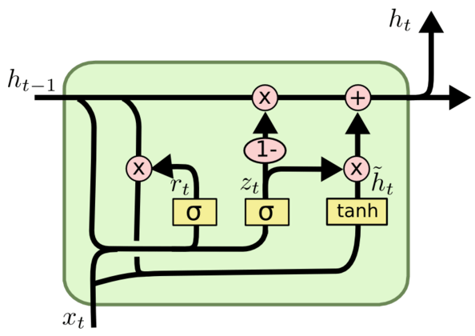

# 🔁 Recurrent Neural Networks (RNNs)

## 🧠 Introduction

Computers don't understand images, sounds, or text the way humans do. Instead, everything must be **converted into numbers**:

- Images → arrays of pixel values as we have seen just few moments ago in CNN
- Text → sequences of word or character embeddings as we will just see in upcoming sessions
- Sound → time series of signal amplitudes

Neural networks process these numbers — and different types of data require different architectures.

- For **images**, CNNs are excellent at capturing spatial patterns.
- For **sequences**, like sentences, stock prices, or audio, we need models that understand **order and memory**.

That’s where **Recurrent Neural Networks (RNNs)** come in.

---

## 🔄 What is an RNN?

A **Recurrent Neural Network (RNN)** is a type of neural network designed to handle **sequential data**, where the **order of inputs matters**. Unlike traditional feedforward neural networks, RNNs have loops that allow information to persist across time steps.

---

## 📖 Real-World Analogy

Imagine you're **listening to a story**. You hear:

> "The glass slipped from her hand. It shattered into pieces."

To understand "It shattered," your brain must remember "glass" from earlier. You **carry forward memory** to make sense of what's happening.

RNNs do something similar — they read inputs one at a time and **remember context** using a hidden state.

---

## ⚙️ How RNNs Work

At each time step `t`, the RNN processes:

- Input `xₜ` (e.g., a word or signal at time `t`)
- Previous hidden state `hₜ₋₁`
- And produces:
  - New hidden state `hₜ`
  - Optional output `yₜ`

### 🔢 Equations:

$$
h_t = \tanh(W_{xh} \cdot x_t + W_{hh} \cdot h_{t-1} + b_h)
$$

$$
y_t = W_{hy} \cdot h_t + b_y
$$

- $x_t$: input at time step $t$  
- $h_{t-1}$: previous hidden state  
- $h_t$: current hidden state  
- $y_t$: output at time step $t$  
- $W_{xh}, W_{hh}, W_{hy}$: weight matrices  
- $b_h, b_y$: biases  
- $\tanh$: non-linear activation function (hyperbolic tangent)

The **hidden state** carries information from previous time steps — it's the "memory" of the network.

---

## 🧱 Multi-layer RNNs (Stacked RNNs)

To capture more complex patterns, RNNs can be **stacked in multiple layers**.

At each time step:

The **deeper the network**, the more abstract and high-level features it can capture from the sequence.

The lower layers might capture short-term dependencies, while higher layers can extract more abstract, longer-term patterns. Although stacking layers helps improve performance on challenging tasks, it also makes training more difficult because of issues like vanishing or exploding gradients. Techniques such as careful initialization, gradient clipping, or using LSTM/GRU units are often employed to address these challenges.

---

## 📦 Unrolling RNN Through Time

During training, the RNN is "unrolled" across time steps:

Each `[RNN]` shares weights. This makes the model efficient and suitable for variable-length sequences.

---
## 🔄 Bidirectional RNNs

Sometimes, understanding a sequence requires looking **both backward and forward**. For example, in language, the meaning of a word can depend on the words that come **before and after** it.

A **Bidirectional RNN (BiRNN)** processes the input sequence in two directions:

- **Forward direction:** from the first time step to the last
- **Backward direction:** from the last time step back to the first

The outputs from both directions are then combined (e.g., concatenated), allowing the network to have information from the **entire sequence context** at every time step.

This improves performance on many tasks such as speech recognition, language modeling, and more.

---
## 📉 Vanishing & Exploding Gradient Problem

### 🔽 Vanishing Gradients

When training long sequences using **Backpropagation Through Time (BPTT)**, gradients can become extremely small.

- This happens when the weights are < 1 and repeatedly multiplied during backpropagation.
- Earlier time steps receive **almost no learning signal**.
- As a result, **long-term dependencies** are forgotten.

📌 *Analogy*: Like whispering a message through 50 people — it becomes meaningless.

### 🔼 Exploding Gradients

- If weights > 1, gradients can become extremely large.
- Leads to **unstable training** or NaNs.

### 🛠 Solutions

- **Gradient Clipping**: Caps gradients during backpropagation to prevent explosion.
- **Better Architectures**: Use LSTM and GRU to mitigate vanishing gradient.

---

## 🔁 Backpropagation Through Time (BPTT)

BPTT is the training algorithm for RNNs. It works by:

1. Unrolling the RNN across time
2. Applying standard backpropagation through each time step
3. Updating shared weights based on total error

However, BPTT is **computationally intensive** and prone to gradient issues on long sequences.

---

## 🚧 Limitations of Vanilla RNNs

| Limitation              | Description |
|--------------------------|-------------|
| Short-term memory        | Can't learn long-term dependencies well |
| Gradient instability     | Suffers from vanishing or exploding gradients |
| Sequential computation   | Hard to parallelize over time |
| Difficulty training deep | Stacked RNNs are harder to train |

---

## 💡 LSTM and GRU to the Rescue

To solve the above issues, advanced variants were developed:

### 🔒 Long Short-Term Memory (LSTM)

- Adds **gates**: input, forget, and output gates
- Maintains a **cell state** for long-term memory
- Learns **what to remember** and **what to forget**

### ⚡ Gated Recurrent Unit (GRU)

- Simplified LSTM with just **reset** and **update** gates
- Less computationally expensive, often similar performance

---
## ✨ Attention Mechanism (Brief Intro)

Standard RNNs, even LSTMs/GRUs, can struggle to capture **long-range dependencies** in very long sequences.

The **Attention Mechanism** helps by letting the model **focus on specific parts of the input sequence** when producing each output. Instead of trying to encode the entire input history into a single hidden state, attention calculates a weighted sum of all hidden states, dynamically deciding which parts are most relevant.

This concept revolutionized sequence modeling and led to powerful architectures like the **Transformer**, widely used in natural language processing today.

---
## 🧠 Summary Table

| Feature                | Vanilla RNN | LSTM | GRU  |
|------------------------|-------------|------|------|
| Long-term memory       | ❌          | ✅   | ✅   |
| Simplicity             | ✅          | ❌   | ✅   |
| Handles vanishing grad | ❌          | ✅   | ✅   |
| Fast training          | ✅          | ❌   | ✅   |

---

## 🧪 Real-World Applications

| Domain        | Use Case                           |
|---------------|-------------------------------------|
| NLP           | Language modeling, translation, sentiment analysis |
| Time Series   | Weather forecast, stock prediction |
| Speech        | Recognition, voice assistants      |
| Music         | Generation and completion          |
| Video         | Action recognition, captioning     |

---

## 🧠 Final Thought

> RNNs are like a person remembering parts of a story — good at capturing recent events but forgetful of things long ago. That’s why we created smarter variants like LSTM and GRU, which know what to remember and what to forget, just like a good storyteller or listener.

You can read more about RNNs [here](https://stanford.edu/~shervine/teaching/cs-230/cheatsheet-recurrent-neural-networks) (**SO RECOMMENDED**)

---

