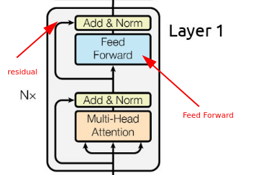

# Transformers - Encoder

## 1. Why Transformers?  
Traditional sequence models (RNNs, LSTMs, GRUs) dominated NLP before Transformers, but they have several limitations:

- **Long-range dependencies**: gradients vanish/explode → difficult to capture context across long sequences.  
- **Sequential nature**: RNNs process tokens one-by-one → hard to parallelize on GPUs.  
- **Training inefficiency**: slow training due to sequential dependency.  
- **Fixed memory bottleneck**: LSTMs compress entire context into a fixed hidden state → information loss.  

**Transformers solve this with:**  
- **Attention**: every token attends directly to all other tokens (no sequential bottleneck).  
- **Parallelism**: all tokens processed simultaneously → faster training.  
- **Better long-range modeling**: attention can link distant words directly.  


---
## 2. Transformers Structure
You can think of a transformer like two blocks called encoder and decoder, we will dive into the two blocks right now.

But before diving in we should make our data ready to go into these neural networks, we need to represent each word with a vector, and maybe try to handle positional information since there’s no recurrence!


---

## 2. Word Embeddings  

Before feeding text into Transformers, words must be converted into vectors.  

### 2.1 One-hot encoding  
- Each word = binary vector with 1 at its index.  
- Problems: very sparse, no semantic meaning (e.g., *king* and *queen* unrelated).  

### 2.2 Word2Vec  
- Predicts context words given a target word [(Skip-gram) or vice versa (CBOW).  ](https://www.geeksforgeeks.org/nlp/word-embeddings-in-nlp-comparison-between-cbow-and-skip-gram-models/)
- Produces **dense vectors** capturing semantic similarity.  
- Example: `vector("king") - vector("man") + vector("woman") ≈ vector("queen")`.  


---

#### 🔹 CBOW (Continuous Bag of Words) - How it Produces Embeddings

The idea: **predict the center word from its context words.**

Example sentence:
`The cat sat on the mat`
Suppose we want to predict the word **sat**, with context window size = 2 → context = `[the, cat, on, the]`.

---

##### **1. Vocabulary & One-hot Encoding**

* Suppose vocab size = `V` words.
* Each word is represented as a **one-hot vector** of size `V`.
* Example: if `V = 10,000`, then the word “cat” is `[0, 0, …, 1, …, 0]`.

---

##### **2. Input → Projection Layer (Embedding Matrix)**

* We have an **embedding matrix** `W` of size `(V × N)` where:
  * `V` = vocab size
  * `N` = embedding dimension (e.g., 300)
* Multiplying a one-hot vector (size `V`) by `W` just selects the row corresponding to that word → that’s the word’s **embedding**.

👉 This is how embeddings are learned!
At the start, `W` is random. Training updates it.

---

##### **3. Combine Context Vectors**

* In **CBOW**, we take embeddings of all context words (from `W`) and average/sum them → this gives a **context representation vector**.

---

##### **4. Hidden → Output Layer**

* Another weight matrix `W'` (size `N × V`).
* Multiply context vector by `W'` → gives logits over vocabulary (size `V`).
* Apply **softmax** → probability distribution over all words in vocab.

---

##### **5. Training Objective**

* Loss = **cross-entropy** between predicted distribution and the true center word (one-hot).
* Backpropagation updates both `W` (input embeddings) and `W'` (output embeddings).
* After training, `W` (or sometimes `(W+W’)/2`) is used as the **word embeddings**.

---

##### 🔹 Example Flow (CBOW)

Predicting "sat" from `[the, cat, on, the]`:

1. One-hot encode `the`, `cat`, `on`.
2. Look up embeddings from `W`.
3. Average them → context vector.
4. Multiply by `W'`, apply softmax → predict probabilities.
5. Compare with true label "sat", update weights.
6. After many sentences, embeddings capture semantic similarity.


---

#### 🔹 Skip-gram Training in Word2Vec

##### 1. Input Sentence

Example:
`The cat sat on the mat`

Context window size = 2
Center word = **sat**
Context words = `[the, cat, on, the]`

So training pairs are:

```
(sat → the), (sat → cat), (sat → on), (sat → the)
```

---

##### 2. Represent Words as One-hot Vectors

* Vocab size = `V`
* Each word = one-hot vector of length `V` (all 0’s except 1 at its index).
* Example: “sat” → `[0, 0, 1, 0, …]`.

---

##### 3. Embedding Matrix (Input Weights)

* Matrix `W` of shape `(V × N)`
  * `V` = vocab size
  * `N` = embedding size (e.g. 100 or 300)
* Multiply one-hot vector by `W` → select row = embedding of that word.
* So `"sat"` one-hot × `W` = **embedding of "sat"**.

---

##### 4. Hidden → Output Layer

* Another matrix `W'` of shape `(N × V)`.
* Multiply embedding by `W'` → get logits (length `V`).
* Apply **softmax** → probability distribution over all words in vocab.

---

##### 5. Training Objective

* For each training pair `(center, context)`,
  maximize probability of context word given center word:

$$
P(context \mid center) = \frac{\exp(v_{context} \cdot v_{center})}{\sum_{w=1}^{V}\exp(v_w \cdot v_{center})}
$$

* Loss = **cross-entropy** between predicted distribution and the true context word (one-hot).

---

##### 6. Updating Embeddings

* Backprop updates both:
  * `W` → input word embeddings
  * `W'` → output word embeddings
* After training, embeddings capture semantics.
* Usually we keep `W` as the final embeddings.

---

##### 🔹 Intuition

* "sat" embedding must be useful to predict its neighbors.
* So words with similar contexts (e.g. "sat", "lay", "slept") end up with similar embeddings.

---

##### 🔹 Example Training Pair

```
Center word: "king"
Context word: "queen"
```

* One-hot("king") → embedding vector
* Multiply by `W'` → softmax over vocab
* Increase probability of "queen"
* Over time: "king" and "queen" embeddings move closer.
---
⚡ Key Point:
The **embeddings are not predefined** — they **emerge as parameters of the NN** (`W`) that are optimized to minimize prediction error. That’s why "king", "queen", "man", "woman" end up close in space: because predicting words in context forces semantic similarity to cluster together.

---


### 2.3 GloVe  
- Global Vectors for Word Representation.  
- Learns embeddings from co-occurrence statistics over the entire corpus.  
- Captures both global (matrix factorization) and local (context window) information.  


### 2.4 Contextual Embeddings

* **Limitation of Word2Vec/GloVe**: They produce **static embeddings**, i.e., the same vector for a word regardless of context.

  * Example: *bank* (river bank vs money bank) → same embedding in static models.
* **ELMo (Embeddings from Language Models)**:

  * Generates **contextualized embeddings** using a deep bidirectional LSTM trained on a large corpus.
  * Each word representation is a function of the **entire sentence**, so *bank* in “river bank” vs “money bank” gets different vectors.
  * Unlike Transformers, ELMo relies on RNNs (biLSTMs), but it was one of the first to show the power of context-dependent embeddings.


* **Transformers (BERT, GPT, etc.)**:

  * Produce **contextual embeddings** where word meaning depends on surrounding words.
  * Use self-attention to capture relationships across the entire sequence more efficiently than RNN-based methods like ELMo.


---

## 3. Positional Encoding  

Transformers have **no inherent sense of order** (unlike RNNs).  
We need a way to inject positional information into token embeddings.  

### 3.1 Intuition  
- Add a position vector to each token embedding.  
- Allows the model to distinguish sequences like:  
  - “Dog bites man” vs “Man bites dog”.  

### 3.2 Sinusoidal Positional Encoding (original paper)  
For position `pos` and dimension `i`:  

$$
PE_{(pos, 2i)} = \sin\left(\frac{pos}{10000^{2i/d_{model}}}\right)
$$

$$
PE_{(pos, 2i+1)} = \cos\left(\frac{pos}{10000^{2i/d_{model}}}\right)
$$  

- Even dimensions use sine, odd dimensions use cosine.  
- Smooth, continuous, allows extrapolation to unseen sequence lengths.  


### 3.3 Learned Positional Embeddings  
- Train a separate embedding vector for each position (like word embeddings).  
- Flexible but limited to max length seen during training.  

---
Let's go and check the code to see the embedding and PE before continuing.

---
## 4. Self Attention


Self-attention is **the heart of the Transformer**. It lets each token in a sequence **look at every other token** and decide what to focus on when creating its representation.


---

### 4.1 Intuition

Imagine the sentence:

```
The cat sat on the mat
```

* The embedding of `"sat"` should know **which words are important** to understand it: `"cat"` and `"mat"` are more relevant than `"the"`.
* Self-attention computes **weights** that tell how much `"sat"` should attend to `"cat"`, `"mat"`, `"the"`, etc.

This happens for **every word simultaneously**, not sequentially like RNNs.

---

### 4.2 Inputs

* Input: sequence of token embeddings $X = [x_1, x_2, ..., x_n]$, each of size $d_{model}$.
* Add **positional encodings** to these embeddings, so the model knows word order.

---

### 4.3 Steps 
#### 1) Compute Q, K, V

For **each token embedding ( x )**:

$$
Q = x W^Q, \quad K = x W^K, \quad V = x W^V
$$

* $W^Q, W^K, W^V$ are learnable matrices of shape $(d_{model}, d_k)$.
* Output:

  * Query (Q) = “what am I looking for?”
  * Key (K) = “what I have”
  * Value (V) = “information I can give”

Think of **Q matching with K to get attention scores**, and then using those scores to weight V.

---

#### 2) Compute Attention Scores

For all tokens:

$$
\text{score}_{i,j} = Q_i \cdot K_j^T
$$

* Compute **dot product** between the query of token $i$ and the key of token $j$.
* Higher score → token $i$ should pay more attention to token $j$.

---

#### 3) Scale the scores

$$
\text{scaled_score}_{i,j} = \frac{Q_i \cdot K_j^T}{\sqrt{d_k}}
$$

* Scaling by $\sqrt{d_k}$ prevents large dot products from making the softmax saturate.

---

#### 4) Apply Softmax

$$
\alpha_{i,j} = \text{softmax}(\text{scaled_score}_{i,j}) = \frac{\exp(\text{scaled_score}_{i,j})}{\sum_{j=1}^n \exp(\text{scaled_score}_{i,j})}
$$

* $\alpha_{i,j}$ = **attention weight**: how much token $i$ attends to token $j$.
* Each row of attention weights sums to 1.

---

#### 5) Weighted Sum

$$
\text{output}_i = \sum_{j=1}^{n} \alpha_{i,j} V_j
$$


* Take the **attention weights** $\alpha_{i,j}$ and multiply them by the corresponding **value vectors** $V_j$.
* Result = a new embedding for token $i$ that contains information from **all tokens** in the sequence, weighted by relevance.

---

#### 6) Matrix Form 

* Let $Q, K, V$ be matrices of shape $(n, d_k)$.
* Compute attention in one shot:

$$
\text{Attention}(Q, K, V) = \text{softmax}\left(\frac{Q K^T}{\sqrt{d_k}}\right) V
$$

* Output shape = $(n, d_k)$ → same number of tokens, updated embeddings.

---

#### 7) Multi-Head Attention

Instead of **one single Q,K,V**, Transformers use **multiple heads**:

$$
\text{head}_i = \text{Attention}(Q W_i^Q, K W_i^K, V W_i^V)
$$

* Multiple heads allow the model to **look at different types of relationships**.
* Continue the process for all heads
* Concatenate all heads → linear projection → final output.

---

#### 1. What a single attention head does

A single attention head computes:

$$
\text{Attention}(Q, K, V) = \text{softmax}\left(\frac{Q K^T}{\sqrt{d_k}}\right)V
$$

* Each token looks at **all other tokens** and decides “how much should I attend to each of them?”
* But a **single head has limited capacity**: it can only focus on **one kind of pattern** in the sequence.

Example:

Sentence:

```
The cat sat on the mat
```

* One head might focus on **subject-object relationships**: “cat” → “sat”
* Another head might focus on **adjectives describing nouns**: “delicious” → “pizza”
* A single head cannot easily capture both types of relations at the same time.

---

#### 2. Multi-head attention

* Transformers use **multiple heads** (e.g., 8 or 12).
* Each head has its **own Q, K, V matrices**, meaning each head projects the embeddings differently.
* This allows **each head to capture a different kind of interaction**.

Examples of “different types of relationships” each head could learn:

| Head | Relationship captured                         |
| ---- | --------------------------------------------- |
| 1    | Subject → Verb (“cat” → “sat”)                |
| 2    | Object → Adjective (“pizza” → “delicious”)    |
| 3    | Prepositional dependencies (“on” → “mat”)     |
| 4    | Coreference or repetition (“it” → “pizza”)    |
| …    | Some semantic similarity or contextual nuance |

---

#### 3. Why it matters

* **Single head = limited focus**
* **Multiple heads = richer representation**
* By concatenating all heads, each token’s final embedding encodes **many perspectives of context simultaneously**.
* This is what makes Transformers **very powerful at capturing complex patterns in language**.

#### 4. Will they always be better? 

* Each head has different $W^Q, W^K, W^V$ at the start.
* That’s why, initially, they compute slightly different attention scores.
* Training encourages specialization, but doesn’t enforce it
    * The **loss function** (e.g., predicting next word) doesn’t explicitly force each head to look at different aspects.
    * If multiple heads end up doing roughly the same thing and still minimize the loss, that’s fine for the optimizer.
* Research (e.g., *“Are Sixteen Heads Really Better than One?”*) shows **some heads become redundant**.
* Some attention heads learn very similar patterns; others specialize.
* Often, only a subset of heads carry meaningful, distinct patterns.


##### Ways to encourage diversity

* **Regularization techniques** (like penalizing similarity between heads).
* **Different initializations** plus careful training.
* **Design choices**, like multi-task objectives, can push heads to focus on different relations.

---

##### Summary:

* Multi-head attention *can* capture different types of relationships, but it’s not guaranteed.
* Random initialization + training usually produces diversity, but some heads might be redundant.


---

💡 **Intuition analogy**:

Think of each head as a **different pair of glasses**:

* One head sees **syntactic structure**
* Another sees **semantic similarity**
* Another sees **long-range dependencies**

Putting them together gives a **full picture of the sentence**.


---

#### 8) Residual Connection + LayerNorm

* Add original embedding: $\text{output} = \text{LayerNorm}(X + \text{MultiHeadOutput})$
* Helps training stability.

---

##### 1. Intuition

* Neural networks can suffer from **internal covariate shift**: as weights change during training, the distribution of inputs to a layer changes.
* This can slow down training or make it unstable.
* **LayerNorm** solves this by normalizing the activations **within a layer**, for each sample, so they have **mean 0 and variance 1**.

---

##### 2. How it works mathematically

Suppose you have a hidden vector for a token:

$$
x = [x_1, x_2, \dots, x_d]
$$

where $d$ = hidden size.

###### Step 1: Compute mean and variance for the vector

$$
\mu = \frac{1}{d} \sum_{i=1}^d x_i, \quad \sigma^2 = \frac{1}{d} \sum_{i=1}^d (x_i - \mu)^2
$$

###### Step 2: Normalize

$$
\hat{x}_i = \frac{x_i - \mu}{\sqrt{\sigma^2 + \epsilon}}
$$

$\epsilon$ is a tiny number to avoid division by zero.

###### Step 3: Scale & shift

$$
y_i = \gamma \hat{x}_i + \beta
$$

* $\gamma$ and $\beta$ are learnable parameters, allowing the network to **rescale or shift** normalized outputs. Their size is the embedding size.

---

##### 3. Key properties

* Normalization is **per-token**, across hidden dimensions.
* Unlike BatchNorm: it doesn’t depend on batch size → works well for Transformers.
* Makes training **faster** and **more stable**.

---

##### 4. Why Transformers use it

* After **multi-head attention** or **feed-forward layers**, activations can vary a lot.
* LayerNorm keeps the scale of activations consistent, which **helps residual connections**.

> Example: without LayerNorm, adding `X + Attention(X)` could blow up or shrink during training.

---

---

### 4.5 Intuition Recap

* **Query** = what this token wants
* **Key** = what another token offers
* **Value** = information to propagate
* Attention = “match Q with all Ks, then sum Vs weighted by match”
* Multi-head → look at multiple relations in parallel.

---

That's enough for now, let's go and see a code for self attention to imagine it better!

---

Tired? we are near the end of the encoder part xD. Jokes aside, the decoder is easier if you understand the encoder!

---
## 5. Feed Forward 


Absolutely! Let’s go step by step and explain **what happens after the multi-head self-attention** in a Transformer encoder block, i.e., the **Feed-Forward layer** and the **Add & LayerNorm** steps.

---

###  5.1 Multi-Head Self-Attention Recap
I know we just took it, but we need this recap before FFN directly!

After multi-head attention:
* Each token now has a new embedding that captures **information from all other tokens**, weighted by relevance.
* Output shape = `(sequence_length, d_model)` (same as input).

But attention alone isn’t enough. We want to **process each token individually further**, to let the model learn more complex transformations.

---

### 5.2 Position-wise Feed-Forward Network (FFN)

After attention, each token embedding goes through a **Feed-Forward network**.

#### 1) What it is

For each token embedding $x$ size$(d_{model}$):

1. **Linear transformation** → expands dimensionality: $x W_1 + b_1$
2. **Non-linearity** → usually ReLU: $\text{ReLU}(x W_1 + b_1)$
3. **Linear transformation back** → reduce to original size: $(\text{ReLU}(x W_1 + b_1)) W_2 + b_2$

Mathematically:

$$
FFN(x) = \text{Linear}_2(\text{ReLU}(\text{Linear}_1(x)))
$$

* $W_1, W_2$ are learnable weight matrices.
* Often, hidden size = 4 × $d_{model}$.

#### 2) Intuition 

* Think of **attention** as a way for a token to **look at other tokens** and decide what’s important.
* FFN is like saying: “OK, now that I know the context, let me **process my own information in more complex ways**.”

Example:

* Word embedding for `"sat"` after attention contains info about `"cat"` and `"mat"`.
* FFN allows `"sat"`’s embedding to combine this info **non-linearly**, emphasizing some features, suppressing others, and capturing complex patterns like **verb tense, emphasis, or semantic nuance**.

#### 3) Why it’s needed

1. **Increases model capacity**

   * Attention alone is linear w.r.t values. FFN introduces **non-linearity**, allowing the network to learn more complex functions.

2. **Processes each token independently**

   * Each token embedding can be transformed differently based on its content after attention.

3. **Expands representation space**

   * Hidden layer $4× ( d_{model} )$ lets the model temporarily project tokens into a higher-dimensional space for richer transformations.

4. **Works with residual + norm**

   * Residual connection ensures that the original info isn’t lost.
   * LayerNorm stabilizes training after these transformations.

---

### 5.3 Add & LayerNorm (after FFN)

Transformers use **residual connections + LayerNorm** twice in each encoder block:

1. After Multi-Head Attention

   `x = LayerNorm(x + MultiHeadAttention(x))`

2. After Feed-Forward

   * `x = LayerNorm(x + FFN(x))`

#### 5.3.1 Residual connection (`x + …`)

* Adds the **original input** of the block to the output.
* Helps prevent vanishing gradients and stabilizes learning.

#### 5.3.2 LayerNorm

* Normalizes the summed vector for **mean=0, variance=1**, per token.
* Ensures consistent scale for the next layer and stabilizes training.

---

### 5.3 Overall Encoder Block Flow

For each input token embedding `x`:

1. **Multi-Head Attention**

   ```
   x1 = LayerNorm(x + MultiHeadAttention(x))
   ```
2. **Feed-Forward**

   ```
   x2 = LayerNorm(x1 + FFN(x1))
   ```
3. Output `x2` → goes to the next encoder block.

💡 **Key points:**

* **Multi-Head Attention:** mixes info **between tokens**.
* **FFN:** transforms info **within each token**.
* **Residual + LayerNorm:** stabilizes and preserves original info.

---


✅ **TL;DR:**

* **Attention:** mixes info between tokens.
* **FFN:** transforms each token’s embedding individually to capture more complex, non-linear features.
* Both together make the Transformer extremely powerful.


---

## **BERT-Base-Uncased Numbers Explained**

### **Key Constants**

| Symbol / Number                   | Meaning                                                                                                              |
| --------------------------------- | -------------------------------------------------------------------------------------------------------------------- |
| **V = 30522**                     | Vocabulary size → total number of unique tokens (words, subwords, punctuation) in the model.                         |
| **d_model = 768**                 | Hidden size of the Transformer → also the size of embeddings. Each token is represented by a 768-dimensional vector. |
| **max_position_embeddings = 512** | Maximum sequence length BERT can process. Each position gets a positional embedding.                                 |
| **type_vocab_size = 2**           | Number of token types (sentence A vs sentence B) for next sentence prediction.                                       |
| **intermediate_size = 3072**      | Size of hidden layer in Feed-Forward Network (FFN) inside each encoder layer. Usually 4 × d_model.                   |
| **num_hidden_layers = 12**        | Number of encoder layers (Transformer blocks) in BERT-Base.                                                          |
| **num_attention_heads = 12**      | Each multi-head attention has 12 heads. Each head has its own Q, K, V matrices.                                      |

---

### **1. Embeddings**

We have **3 types of embeddings** + LayerNorm:

1. **Word embeddings** → shape `[V, d_model] = [30522, 768]`

   * Parameters = 30522 × 768 = **23,440,896**
   * Each row is a vector representing a token.

2. **Position embeddings** → shape `[512, 768]`

   * Parameters = 512 × 768 = **393,216**
   * Encodes the position of tokens in the sequence.

3. **Token type embeddings** → shape `[2, 768]`

   * Parameters = 2 × 768 = **1,536**
   * Encodes sentence A vs sentence B.

4. **LayerNorm** → weight + bias `[768]` each

   * Weight = 768
   * Bias = 768

**Embeddings subtotal**:
23,440,896 + 393,216 + 1,536 + 768 + 768 = **23,837,184**

---

### **2. Transformer Encoder (12 layers)**

Each layer has **Self-Attention + FFN + LayerNorm**.

#### **2.1 Self-Attention**

Each **multi-head attention** has **Q, K, V** for each head. In BERT-Base:

* d_model = 768, num_heads = 12 → each head dimension = 768 / 12 = 64

**Weights per head**:

| Matrix         | Shape      | Parameters          | Notes                                  |
| -------------- | ---------- | ------------------- | -------------------------------------- |
| Q              | [768, 768] | 768 × 768 = 589,824 | Projects d_model → 12 heads of 64 each |
| K              | [768, 768] | 589,824             | Same                                   |
| V              | [768, 768] | 589,824             | Same                                   |
| Biases Q, K, V | [768] each | 768 × 3 = 2,304     |                                        |

**Attention output dense** → shape `[768, 768]`

* 768 × 768 = 589,824 + bias 768

**Attention LayerNorm** → weight + bias `[768]` each = 768 × 2 = 1,536

**Self-Attention subtotal per layer**:
Q + K + V + biases + output dense (linear projection after attention) + output bias + LayerNorm 

* Q = 589,824
* K = 589,824
* V = 589,824
* Q/K/V bias = 768 × 3 = 2,304
* Output dense = 589,824
* Output bias = 768
* LayerNorm weight/bias = 768 + 768 = 1,536

Sum = 589,824 × 4 = 2,359,296
2,359,296 + 2,304 + 768 + 1,536 = 2,363,904 + 768 = 2,364,672 

---

#### **2.2 Feed-Forward Network (FFN)**

* Hidden size = 3072

| Matrix             | Shape               | Parameters             |
| ------------------ | ------------------- | ---------------------- |
| Intermediate dense | [3072, 768]         | 3072 × 768 = 2,359,296 |
| Bias               | [3072]              | 3,072                  |
| Output dense       | [768, 3072]         | 768 × 3072 = 2,359,296 |
| Bias               | [768]               | 768                    |
| LayerNorm          | [768] weight + bias | 768 + 768 = 1,536      |

**FFN subtotal per layer** = 2,359,296 + 3,072 + 2,359,296 + 768 + 1,536 = 4,723,968 + 768 + 1,536 = 4,726,272 

---

#### **2.3 Total per layer**

Self-Attention + FFN = 2,364,672 + 4,726,272 = **7,090,944** per layer

**12 layers** → 7,090,944 × 12 = **85,091,328**

---

### **3. Pooler**

* Dense `[768, 768]` → 768 × 768 = 589,824
* Bias = 768
* **Pooler subtotal** = 590,592

---

### **4. Total BERT-Base Parameters**

* Embeddings: 23,837,184
* Encoder: 85,091,328
* Pooler: 590,592

**Grand Total = 23,837,184 + 85,091,328 + 590,592 = 109,519,104 (~110M)** 


---

### ✅ Encoder Finished!

We’ve now **finished the encoder part** of the Transformer! Here’s what we covered:

* **Embeddings** → turning words into vectors
* **Positional Encoding** → letting the model know the word order
* **Multi-head Self-Attention** → letting each word look at every other word
* **Feed-Forward Network (FFN)** → adding more depth and non-linearity
* **Residual Connections + LayerNorm** → keeping training stable

---

### 🔹 Where Encoders & Decoders Are Used

* **Encoder-only**: like **BERT** → tasks that need understanding text (e.g., sentiment analysis, Q&A)
* **Encoder + Decoder**: like **original Transformer for translation** → tasks where you need to understand *and* generate sequences
* **Decoder-only**: like **GPT** → tasks that focus on generating text

---

We’ve now **finished the “header part”**, all the foundational concepts for the encoder are done! Next, we can dive into the decoder and full sequence-to-sequence stuff.

---


